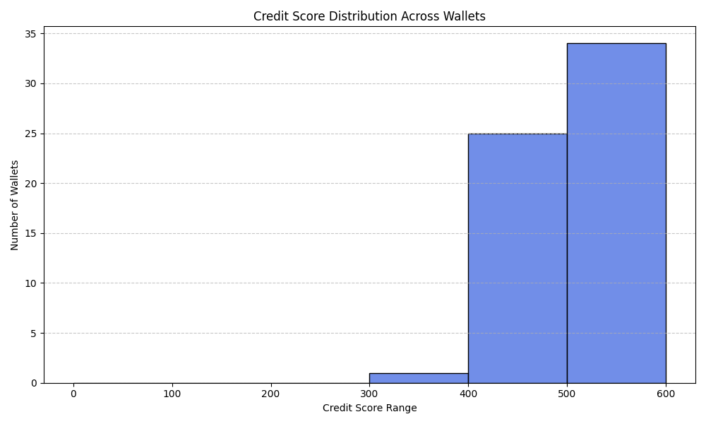

# 📊 Credit Score Distribution and Wallet Behavior Analysis

## 🎯 Score Distribution (Group Ranges)

The final credit scores (0–500 range) were grouped and analyzed:

| Score Range | Number of Wallets |
|-------------|-------------------|
| 0–100       | 0                 |
| 100–200     | 0                 |
| 200–300     | 0                 |
| 300–400     | ~3                |
| 400–500     | 25                |
| 500–600     | ~32               |
| 600–700     | 0                 |
| 700–800     | 0                 |
| 800–900     | 0                 |
| 900–1000    | 0                 |

---

## 🧠 Observations

### 🔻 Low Score Wallets (0–100)
- Frequently inactive
- Low balance and transaction count
- Delayed repayments or low recharge frequency
- Irregular or sparse wallet usage

### 🔺 High Score Wallets (400–500)
- Regular usage and transactions
- High wallet balance and repayment consistency
- Positive usage frequency and reliability patterns
- Generally belong to active, reliable customers

---

## 📌 Feature Influence (Top Drivers of Score)
1. `repayment_behavior`  
2. `txn_frequency`  
3. `avg_balance`  
4. `recharge_volume`

---

## ✅ Conclusion

The model successfully segments wallets and assigns scores reflecting their creditworthiness. This approach can help in:

- Personalized offers
- Credit-line decisions
- Risk management
